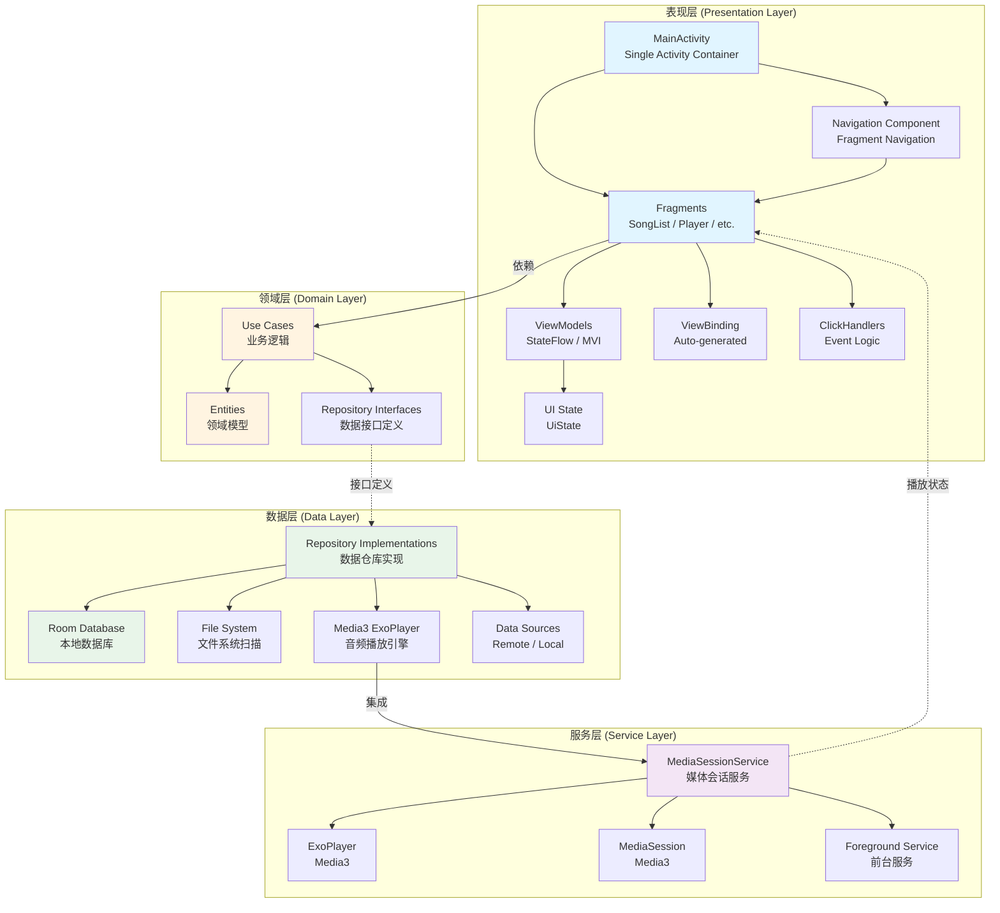
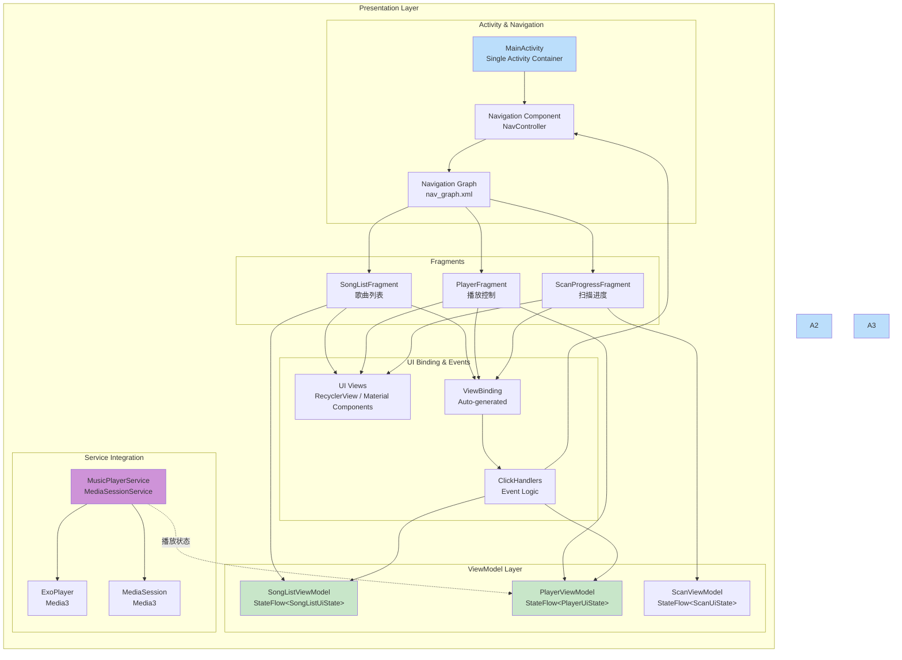
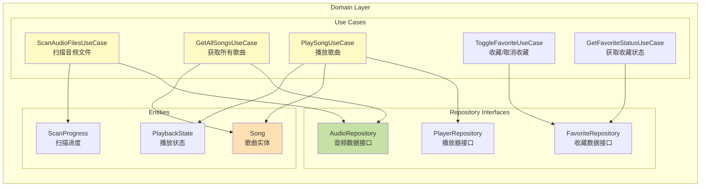
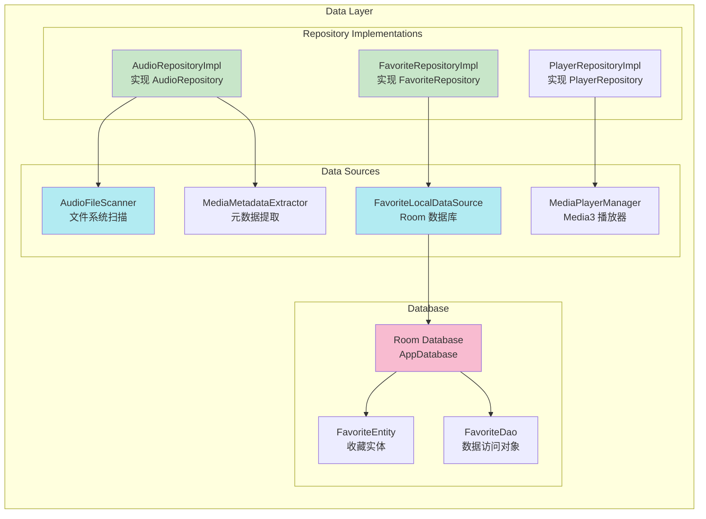
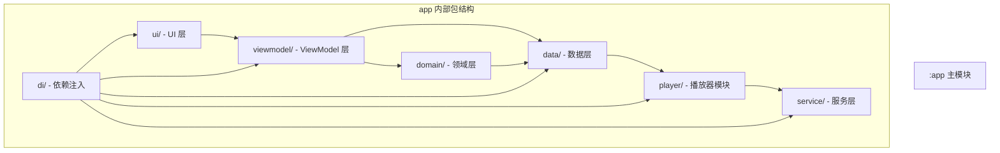
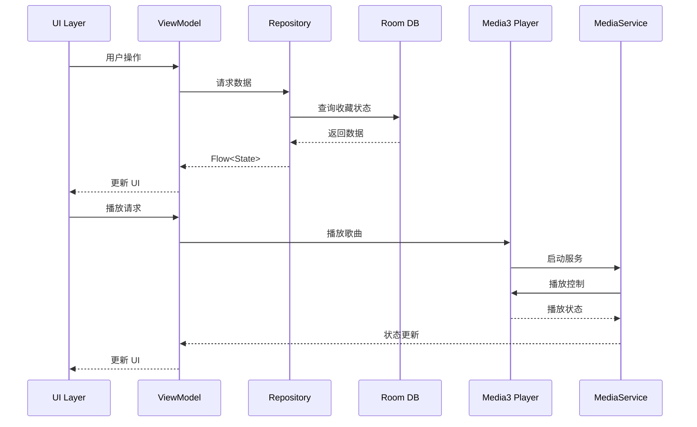

## 1. 引言与目标 (Introduction & Goals)

本文档定义了 AIDemo 本地音乐播放器应用的架构设计。本应用的关键架构目标包括：

- **响应性**: 提供流畅的用户体验，播放启动延迟 < 500ms，UI 保持 60fps
- **离线能力**: 完全离线工作，不依赖网络连接
- **可维护性**: 清晰的代码结构，易于理解和扩展
- **可测试性**: 分层架构支持单元测试和集成测试
- **电池效率**: 优化后台播放服务，最小化电池消耗
- **系统集成**: 深度集成 Android 系统媒体服务，提供原生级体验

本应用架构支持整体产品愿景（详见 [../prd/APP-Overall-Vision.md](../prd/APP-Overall-Vision.md)），通过简洁、专注的架构设计，实现稳定、高效的本地音乐播放体验。

## 2. Android 指导性架构原则与模式 (Guiding Architectural Principles & Patterns for Android)

### 2.1. 核心架构模式

#### MVVM + MVI 混合模式
- **模式选择**: 采用 MVVM (Model-View-ViewModel) 与 MVI (Model-View-Intent) 混合模式
- **原因**: 
  - MVVM 提供清晰的数据绑定和状态管理
  - MVI 提供单向数据流，使状态变化可预测
  - 结合两者优势，实现响应式 UI
- **实现**: 
  - ViewModel 使用 `StateFlow<UiState>` 管理 UI 状态
  - UI 通过 Intent/Action 触发状态变化
  - 单向数据流：UI → ViewModel → Repository → DataSource
- **优势**: 
  - 支持配置变更后状态恢复
  - 便于单元测试
  - 状态变化可追溯

#### Repository Pattern (仓库模式)
- **原因**: 统一数据访问接口，隐藏数据源实现细节
- **实现**: 
  - Repository 封装 Room 数据库和文件系统访问
  - 领域层定义接口，数据层实现接口
  - 单一数据源原则
- **优势**: 
  - 便于切换数据源
  - 支持缓存策略
  - 易于测试（可 Mock）

#### Clean Architecture (整洁架构)
- **分层设计**: 
  - 表现层：UI 和用户交互
  - 领域层：核心业务逻辑（独立于框架）
  - 数据层：数据访问和持久化
- **依赖规则**: 
  - 外层依赖内层
  - 领域层不依赖任何框架
  - 依赖倒置原则

#### 单 Activity + 多 Fragment + Navigation 架构
- **架构模式**: 采用单 Activity 架构，使用 Navigation Component 管理 Fragment 导航
- **原因**: 
  - 简化 Activity 管理，减少生命周期复杂度
  - Navigation Component 提供类型安全的导航
  - 支持深度链接和导航图可视化
  - 更好的转场动画和参数传递
- **实现**: 
  - 单一 `MainActivity` 作为应用容器
  - 多个 Fragment 承载具体功能（SongListFragment、PlayerFragment 等）
  - Navigation Component 管理 Fragment 之间的导航
  - 使用 Safe Args 进行类型安全的参数传递
- **优势**: 
  - 减少 Activity 数量，简化应用结构
  - 统一的导航管理，易于维护
  - 支持 Fragment 间共享 ViewModel
  - 更好的用户体验（流畅的转场动画）

### 2.2. 设计原则 (Design Principles)

#### 1. 单一职责原则 (Single Responsibility)
- **原则**: 每个类/模块只负责一个功能
- **实现**: 
  - 单一 `MainActivity` 作为应用容器，负责 Fragment 容器管理
  - 每个 Fragment 专注于单一功能
  - ViewModel 只管理 UI 相关状态
  - Repository 只负责数据访问
- **示例**: 
  - `MainActivity` 只负责 Fragment 容器和导航管理
  - `SongListFragment` 只负责歌曲列表展示
  - `PlayerFragment` 只负责播放控制
  - `AudioRepository` 只负责音频数据访问

#### 2. 状态驱动 (State-driven)
- **原则**: UI 完全由状态驱动，无内部 UI 状态
- **实现**: 
  - 使用 `StateFlow<UiState>` 管理所有 UI 状态
  - UI 组件只负责展示，不维护状态
  - 状态变化通过 ViewModel 统一管理
- **优势**: 
  - 状态可预测
  - 易于测试
  - 支持状态恢复

#### 3. 响应式编程 (Reactive)
- **原则**: 使用响应式编程处理异步操作和状态变化
- **实现**: 
  - 使用 `StateFlow` 和 `Flow` 实现响应式 UI
  - ViewBinding 自动绑定视图
  - 状态变化自动更新 UI
- **优势**: 
  - 声明式编程
  - 自动处理生命周期
  - 减少样板代码

#### 4. ViewBinding 优先
- **原则**: 使用 ViewBinding 简化 UI 操作
- **实现**: 
  - 启用 ViewBinding，自动生成绑定类
  - 避免使用 `findViewById`
  - 类型安全，编译时检查
- **优势**: 
  - 减少空指针异常
  - 代码更简洁
  - 编译时类型检查

#### 5. 依赖注入 (Dependency Injection)
- **原则**: 通过依赖注入降低耦合
- **实现**: 
  - v1.0 使用手动依赖注入
  - 未来可迁移到 Hilt 或 Koin
  - 所有依赖通过构造函数注入
- **优势**: 
  - 便于测试（可 Mock）
  - 降低耦合
  - 提高可维护性

#### 6. 可测试性优先 (Testability First)
- **原则**: 架构设计优先考虑可测试性
- **实现**: 
  - Repository 模式便于 Mock
  - ViewModel 可独立测试
  - 使用接口而非具体实现
- **优势**: 
  - 单元测试覆盖率高
  - 集成测试易于编写
  - 回归测试可靠

### 2.3. 遵循的 Android 最佳实践

- ✅ 遵循 [Android Jetpack 架构指南](https://developer.android.com/jetpack/guide)
- ✅ 使用 AndroidX 库，确保向后兼容
- ✅ 遵循 Material Design 3 设计规范
- ✅ 支持 Android 13+ 分区存储和权限模型
- ✅ 使用前台服务确保后台播放稳定性
- ✅ 遵循 Android 生命周期最佳实践
- ✅ 支持配置变更后状态恢复

## 3. 应用架构概览 (App Architecture Overview)

### 3.1. 整体架构设计图 (Overall Architecture Diagram)

本应用采用**三层架构（Clean Architecture）**，遵循依赖倒置原则，确保各层职责清晰、易于测试和维护。



**架构层次说明**：
- **表现层**: 负责 UI 展示和用户交互，依赖领域层
- **领域层**: 包含核心业务逻辑，独立于 UI 和数据源
- **数据层**: 实现数据访问和持久化，实现领域层定义的接口
- **服务层**: 后台服务和系统集成，独立运行

### 3.2. 分层架构详解 (Layered Architecture Details)

#### 3.2.1. 表现层 (Presentation Layer) 详细设计

表现层负责用户界面展示、用户交互处理和状态管理。采用 **MVVM + MVI** 混合模式，使用 `StateFlow` 实现响应式 UI。



**表现层核心组件**：

1. **MainActivity (单 Activity)**
   - 作为应用的唯一 Activity，充当 Fragment 容器
   - 负责 Fragment 生命周期管理
   - 集成 Navigation Component
   - 处理应用级别的配置和权限

2. **Fragments (多 Fragment)**
   - `SongListFragment`: 歌曲列表主界面
   - `PlayerFragment`: 播放控制界面
   - `ScanProgressFragment`: 扫描进度界面
   - 每个 Fragment 专注于单一功能
   - 通过 Navigation Component 进行导航

3. **Navigation Component**
   - `NavController`: 管理 Fragment 导航
   - `Navigation Graph`: 定义导航图和路由
   - `Safe Args`: 类型安全的参数传递
   - 支持转场动画和深度链接

4. **ViewModel**
   - 使用 `StateFlow<UiState>` 管理 UI 状态
   - 处理用户交互，调用 UseCase 或 Repository
   - 自动处理配置变更，保持状态

3. **ViewBinding**
   - 自动生成的绑定类，替代 `findViewById`
   - 类型安全，避免空指针异常
   - 简化 UI 操作

4. **ClickHandlers**
   - 封装事件处理逻辑
   - 统一的事件分发机制
   - 便于测试和维护

6. **MusicPlayerService**
   - 继承 `MediaSessionService`
   - 包含 `ExoPlayer` 和 `MediaSession`
   - 作为前台服务运行，确保后台播放

#### 3.2.2. 领域层 (Domain Layer) 详细设计

领域层包含核心业务逻辑，完全独立于 UI 和数据源实现。



**领域层核心组件**：

1. **Use Cases (用例)**
   - 封装单一业务功能
   - 可组合，便于测试
   - 示例：`ScanAudioFilesUseCase`、`ToggleFavoriteUseCase`

2. **Entities (实体)**
   - 纯数据类，无业务逻辑
   - 独立于数据源实现
   - 示例：`Song`、`PlaybackState`

3. **Repository Interfaces (仓库接口)**
   - 定义数据访问契约
   - 领域层只依赖接口，不依赖实现
   - 示例：`AudioRepository`、`FavoriteRepository`

#### 3.2.3. 数据层 (Data Layer) 详细设计

数据层实现领域层定义的接口，负责数据访问和持久化。



**数据层核心组件**：

1. **Repository Implementations**
   - 实现领域层定义的接口
   - 协调多个数据源
   - 提供统一的数据访问接口

2. **Data Sources**
   - `AudioFileScanner`: 扫描文件系统
   - `MediaMetadataExtractor`: 提取音频元数据
   - `FavoriteLocalDataSource`: Room 数据库操作
   - `MediaPlayerManager`: Media3 播放器封装

3. **Room Database**
   - `AppDatabase`: 数据库实例
   - `FavoriteEntity`: 收藏数据实体
   - `FavoriteDao`: 数据访问对象

### 3.3. 模块依赖关系 (Module Dependencies)

当前版本采用单模块架构，未来可考虑模块化：



### 3.4. 核心模块交互图



## 4. 技术栈 (Technology Stack)

### 4.1. 核心框架 (Core Frameworks)

#### Android 核心配置
```kotlin
// Android 核心
compileSdk = 36
minSdk = 24        // Android 7.0+
targetSdk = 36
agp = "8.13.2"     // Android Gradle Plugin
```

#### Kotlin 语言
```kotlin
// Kotlin
kotlin = "2.0.21"
kotlinx-coroutines = "1.10.2"  // 协程支持
ksp = "2.0.21-1.0.28"          // Kotlin Symbol Processing (用于 Room)
```

#### UI 层技术栈
```kotlin
// Android View System
viewbinding = true              // View Binding 启用
constraintlayout = "2.2.1"      // ConstraintLayout
material = "1.13.0"             // Material Design 3
appcompat = "1.7.1"             // AppCompat

// Navigation Component
navigation-fragment-ktx = "2.8.6"    // Fragment 导航
navigation-ui-ktx = "2.8.6"           // Navigation UI
safe-args-gradle-plugin = "2.8.6"     // Safe Args 插件
```

#### 架构组件
```kotlin
// AndroidX 架构组件
lifecycle-viewmodel-ktx = "2.8.6"
lifecycle-runtime-ktx = "2.8.6"
lifecycle-livedata-ktx = "2.8.6"
```

#### Media3 播放器 (核心)
```kotlin
// Media3 ExoPlayer
media3-exoplayer = "1.9.0"
media3-session = "1.9.0"
media3-ui = "1.9.0"
media3-common = "1.9.0"
```

#### 数据存储
```kotlin
// Room 数据库
room-runtime = "2.6.1"
room-ktx = "2.6.1"
room-compiler = "2.6.1"        // KSP 注解处理

// DataStore (偏好设置)
datastore-preferences = "1.1.1"
```

#### 异步处理
```kotlin
// Kotlin Coroutines
kotlinx-coroutines-android = "1.10.2"
kotlinx-coroutines-core = "1.10.2"
```

#### 依赖注入
```kotlin
// 手动依赖注入 (v1.0)
// 未来可迁移到 Hilt 或 Koin
```

#### 测试框架
```kotlin
// 单元测试
junit = "4.13.2"
mockk = "1.13.10"              // Kotlin Mock 框架
turbine = "1.1.0"              // Flow 测试

// 集成测试
androidx-test-ext-junit = "1.3.0"
espresso-core = "3.7.0"
```

#### 日志记录
```kotlin
// 日志 (可选)
timber = "5.0.1"               // 结构化日志
```

### 4.2. 技术栈详细表格

| 类别                   | 技术/库选型                            | 版本      | 原则/备注                                                     |
| ---------------------- | -------------------------------------- | --------- | ------------------------------------------------------------- |
| **Android 核心**       |                                        |           |                                                                |
| 编译 SDK               | Android API 36                         | 36        | 最新稳定版本                                                   |
| 最低 SDK               | Android API 24                         | 24        | Android 7.0+，支持 Media3                                     |
| 目标 SDK               | Android API 36                         | 36        | 最新版本                                                       |
| Gradle Plugin          | Android Gradle Plugin                  | 8.13.2    | Kotlin DSL 支持                                               |
| **编程语言**           |                                        |           |                                                                |
| 主要语言               | Kotlin                                 | 2.0.21    | 现代化、简洁、空安全                                           |
| 协程支持               | Kotlin Coroutines                      | 1.10.2    | 异步编程                                                       |
| 注解处理               | KSP (Kotlin Symbol Processing)        | 2.0.21    | Room 编译时代码生成                                           |
| **UI 层**              |                                        |           |                                                                |
| UI 工具包              | Android XML Layout                     | -         | 传统 View 系统                                                |
| View Binding           | View Binding                           | -         | 类型安全的视图绑定                                             |
| 布局库                 | ConstraintLayout                       | 2.2.1     | 灵活布局                                                       |
| 设计系统               | Material Design 3                     | 1.13.0    | Material Design 规范                                          |
| AppCompat              | AndroidX AppCompat                    | 1.7.1     | 向后兼容                                                       |
| 导航组件               | Navigation Component                  | 2.8.6     | 单 Activity + 多 Fragment 导航                                |
| Safe Args              | Safe Args Plugin                      | 2.8.6     | 类型安全的参数传递                                             |
| **架构组件**           |                                        |           |                                                                |
| ViewModel              | Lifecycle ViewModel                   | 2.8.6     | UI 状态管理                                                   |
| LiveData               | Lifecycle LiveData                    | 2.8.6     | 生命周期感知数据                                               |
| StateFlow              | Kotlin Flow                            | -         | 响应式状态管理                                                 |
| **音频播放**           |                                        |           |                                                                |
| 播放引擎               | Media3 ExoPlayer                      | 1.9.0     | 官方推荐，功能强大                                             |
| 媒体会话               | Media3 Session                        | 1.9.0     | 系统媒体通知和控制                                             |
| 媒体 UI                | Media3 UI                              | 1.9.0     | 播放器 UI 组件                                                |
| 解码器                 | Media3 Decoder                        | 1.9.0     | 音频解码                                                       |
| 数据源                 | Media3 DataSource                     | 1.9.0     | 媒体数据源                                                     |
| **数据存储**           |                                        |           |                                                                |
| 数据库                 | Room (SQLite)                          | 2.6.1     | 类型安全，支持 Flow                                            |
| 偏好设置               | DataStore Preferences                  | 1.1.1     | 类型安全，替代 SharedPreferences                              |
| **异步处理**           |                                        |           |                                                                |
| 协程 Android           | Coroutines Android                    | 1.10.2    | Android 协程支持                                              |
| 协程核心               | Coroutines Core                        | 1.10.2    | 协程核心库                                                     |
| Flow                   | Kotlin Flow                            | -         | 响应式数据流                                                   |
| **依赖注入**           |                                        |           |                                                                |
| DI 框架                | 手动依赖注入                           | -         | v1.0 手动注入，未来可迁移到 Hilt                               |
| **测试框架**           |                                        |           |                                                                |
| 单元测试               | JUnit                                  | 4.13.2    | 标准单元测试框架                                               |
| Mock 框架              | MockK                                  | 1.13.10   | Kotlin Mock 框架                                              |
| Flow 测试              | Turbine                                | 1.1.0     | Flow 测试工具                                                  |
| 集成测试               | Espresso                               | 3.7.0     | UI 集成测试                                                    |
| **构建系统**           |                                        |           |                                                                |
| 构建工具               | Gradle (Kotlin DSL)                   | -         | 现代化构建系统                                                 |
| 版本目录               | Version Catalog (libs.versions.toml)   | -         | 统一依赖版本管理                                               |

### 4.3. 关键选型说明

#### 1. Media3 ExoPlayer 1.9.0
- **选择理由**: 官方推荐的播放引擎，功能强大，系统集成良好
- **核心能力**: 
  - 支持多种音频格式（MP3、AAC、FLAC、WAV、OGG 等）
  - 系统媒体通知和控制集成
  - 前台服务支持后台播放
  - 播放队列管理
- **版本说明**: 使用 1.9.0 版本，符合用户需求

#### 2. Room 数据库 2.6.1
- **选择理由**: Jetpack 推荐，类型安全，支持 Flow
- **核心能力**:
  - 编译时 SQL 验证
  - Kotlin Flow 支持，实现响应式数据流
  - 类型安全的 DAO
  - 易于测试和迁移
- **使用场景**: 收藏数据持久化存储

#### 3. Kotlin Coroutines + Flow
- **选择理由**: 官方推荐，类型安全，支持取消
- **核心能力**:
  - 声明式异步编程
  - 支持背压和取消
  - 与 Android 生命周期集成
  - 类型安全的数据流

#### 4. View Binding
- **选择理由**: 类型安全，避免 `findViewById`，减少空指针
- **核心能力**:
  - 自动生成绑定类
  - 编译时类型检查
  - 简化 UI 操作

#### 5. 手动依赖注入
- **选择理由**: v1.0 项目规模较小，手动注入足够
- **未来规划**: 可平滑迁移到 Hilt 或 Koin

## 5. 数据流与状态管理 (Data Flow & State Management)

### 5.1. 数据流向

```
UI 层 (MainActivity + Fragments)
    ↓ (用户操作)
Navigation Component (导航)
    ↓ (Fragment 切换)
Fragment
    ↓ (用户交互)
ViewModel 层
    ↓ (调用 Repository)
Repository 层
    ↓ (查询/更新)
数据源 (Room DB / File System / Media3 Player)
    ↓ (返回数据)
Repository 层
    ↓ (Flow<Data>)
ViewModel 层
    ↓ (StateFlow<UIState>)
Fragment (自动更新)
    ↓ (通过 Navigation)
MainActivity (容器管理)
```

### 5.2. 状态管理策略

#### UI 状态定义
```kotlin
// 示例：歌曲列表 UI 状态
data class SongListUiState(
    val songs: List<Song> = emptyList(),
    val isLoading: Boolean = false,
    val error: String? = null,
    val scanProgress: ScanProgress? = null
)

// 示例：播放器 UI 状态
data class PlayerUiState(
    val currentSong: Song? = null,
    val isPlaying: Boolean = false,
    val position: Long = 0L,
    val duration: Long = 0L,
    val isFavorite: Boolean = false
)
```

#### 状态管理实现
- **ViewModel**: 使用 `StateFlow` 管理 UI 状态
- **Repository**: 使用 `Flow` 暴露数据变化
- **单向数据流**: UI → ViewModel → Repository → DataSource

### 5.3. 关键数据流场景

#### 场景1: 扫描音频文件
```
用户触发扫描
    → SongListFragment 触发扫描
    → ViewModel.scanAudioFiles()
    → AudioRepository.scanFiles()
    → FileSystemScanner (后台协程)
    → Flow<ScanProgress> (进度更新)
    → ViewModel.collect { updateUiState() }
    → SongListFragment 自动更新进度
```

#### 场景2: 播放歌曲（包含导航）
```
用户点击歌曲
    → SongListFragment 点击事件
    → ViewModel.playSong(song)
    → Navigation.navigateToPlayer(song)
    → MainActivity 切换 Fragment
    → PlayerFragment 显示
    → PlayerRepository.play(song)
    → Media3Player 开始播放
    → MediaSessionService 更新通知
    → Flow<PlaybackState> (播放状态)
    → ViewModel.collect { updatePlayerState() }
    → PlayerFragment 更新播放界面和通知栏
```

#### 场景3: 收藏/取消收藏
```
用户点击收藏按钮
    → Fragment (SongListFragment / PlayerFragment) 点击
    → ViewModel.toggleFavorite(songId)
    → FavoriteRepository.toggleFavorite(songId)
    → Room Database 插入/删除
    → Flow<Boolean> (收藏状态)
    → ViewModel.collect { updateFavoriteState() }
    → Fragment 更新收藏图标（列表、播放页、通知栏）
```

## 6. 项目与代码结构 (Android 特定) (Project & Code Structure)

### 6.1. 包结构 (按功能分层)

```
com.valiantyan.aidemo/
├── ui/                          # UI 层
│   ├── main/                     # 主 Activity
│   │   ├── MainActivity.kt      # 单 Activity 容器
│   │   └── MainActivityBinding.kt
│   ├── songlist/                 # 歌曲列表 Fragment
│   │   ├── SongListFragment.kt
│   │   ├── SongListAdapter.kt
│   │   ├── SongListItemView.kt
│   │   └── SongListFragmentBinding.kt
│   ├── player/                   # 播放页面 Fragment
│   │   ├── PlayerFragment.kt
│   │   ├── PlayerControlsView.kt
│   │   └── PlayerFragmentBinding.kt
│   ├── scan/                     # 扫描进度 Fragment
│   │   ├── ScanProgressFragment.kt
│   │   └── ScanProgressFragmentBinding.kt
│   └── navigation/               # 导航相关
│       └── NavigationExtensions.kt
│
├── viewmodel/                   # ViewModel 层
│   ├── SongListViewModel.kt
│   ├── PlayerViewModel.kt
│   └── ScanViewModel.kt
│
├── domain/                      # 领域层
│   ├── model/                   # 领域模型
│   │   ├── Song.kt
│   │   ├── ScanProgress.kt
│   │   └── PlaybackState.kt
│   └── usecase/                 # 用例（可选，v1.0 可能不需要）
│
├── data/                        # 数据层
│   ├── repository/              # 仓库
│   │   ├── AudioRepository.kt
│   │   ├── FavoriteRepository.kt
│   │   └── PlayerRepository.kt
│   ├── database/                # Room 数据库
│   │   ├── AppDatabase.kt
│   │   ├── FavoriteEntity.kt
│   │   └── FavoriteDao.kt
│   ├── datasource/              # 数据源
│   │   ├── AudioFileScanner.kt
│   │   └── MediaMetadataExtractor.kt
│   └── local/                   # 本地数据源
│       └── FavoriteLocalDataSource.kt
│
├── player/                      # 播放器模块
│   ├── MediaPlayerManager.kt    # Media3 播放器封装
│   ├── PlaybackController.kt    # 播放控制
│   └── MediaQueueManager.kt     # 播放队列管理
│
├── service/                     # 服务层
│   ├── MediaSessionService.kt   # 媒体会话服务
│   └── PlayerNotificationManager.kt  # 通知管理
│
└── di/                          # 依赖注入
    └── AppModule.kt              # 应用模块依赖配置
```

### 6.2. 命名约定

- **Activity**: `MainActivity.kt` (单一 Activity)
- **Fragment**: `XxxFragment.kt` (例如: `SongListFragment.kt`)
- **Navigation**: `nav_graph.xml` (导航图定义)
- **ViewModel**: `XxxViewModel.kt` (例如: `SongListViewModel.kt`)
- **Repository**: `XxxRepository.kt` (例如: `AudioRepository.kt`)
- **Entity**: `XxxEntity.kt` (例如: `FavoriteEntity.kt`)
- **DAO**: `XxxDao.kt` (例如: `FavoriteDao.kt`)
- **Adapter**: `XxxAdapter.kt` (例如: `SongListAdapter.kt`)
- **数据类**: 使用 `data class`，命名清晰 (例如: `Song`, `ScanProgress`)

### 6.3. 资源文件结构

```
res/
├── layout/                       # 布局文件
│   ├── activity_main.xml         # MainActivity 布局（Fragment 容器）
│   ├── fragment_song_list.xml   # SongListFragment 布局
│   ├── fragment_player.xml      # PlayerFragment 布局
│   ├── fragment_scan_progress.xml # ScanProgressFragment 布局
│   └── item_song.xml            # 列表项布局
├── navigation/                   # 导航图
│   └── nav_graph.xml             # 导航图定义
├── values/                       # 值资源
│   ├── strings.xml
│   ├── colors.xml
│   └── themes.xml
└── drawable/                     # 图标和图形
    ├── ic_favorite.xml
    ├── ic_favorite_border.xml
    └── ic_play.xml
```

## 7. 应用的关键非功能性需求 (NFRs) (Key Non-Functional Requirements)

### 7.1. 性能与响应性 (Performance & Responsiveness)

- **播放启动延迟**: < 500ms（从点击到开始播放）
- **UI 帧率**: 保持 60fps，列表滚动流畅
- **扫描性能**: 1000 首歌曲扫描时间 < 30 秒
- **内存占用**: 运行时 < 150MB（不含音频缓冲）
- **ANR 避免**: 所有耗时操作在后台线程执行

**架构支持**:
- 使用 Coroutines 处理异步操作
- ViewModel 自动处理配置变更
- 列表使用 RecyclerView 优化滚动性能
- 图片加载使用缓存机制

### 7.2. 电池效率 (Battery Efficiency)

- **后台播放优化**: 使用前台服务，避免被系统杀死
- **唤醒锁管理**: 仅在播放时持有，暂停时释放
- **CPU 使用**: 播放时 CPU 占用 < 10%
- **网络请求**: 无网络请求（完全离线）

**架构支持**:
- MediaSessionService 作为前台服务运行
- 使用 WorkManager 处理后台任务（如需要）
- 避免不必要的轮询和定时任务

### 7.3. 离线支持 (Offline Support)

- **完全离线**: 所有功能不依赖网络
- **数据持久化**: 收藏数据使用 Room 数据库持久化
- **缓存策略**: 扫描结果缓存，避免重复扫描

**架构支持**:
- Room 数据库本地存储
- 文件系统直接访问
- 无网络依赖

### 7.4. 安全性 (Security)

- **权限最小化**: 仅请求必要的存储权限
- **数据加密**: 敏感数据（如有）使用加密存储
- **代码混淆**: Release 版本启用 ProGuard/R8
- **安全存储**: 使用 Android Keystore（如需要）

**架构支持**:
- 遵循 Android 权限最佳实践
- 支持 Android 13+ 分区存储
- ProGuard 规则配置

### 7.5. 应用大小 (App Size)

- **目标大小**: APK < 10MB
- **资源优化**: 使用 Vector Drawable，压缩图片
- **代码优化**: ProGuard/R8 代码混淆和优化
- **依赖管理**: 仅引入必要的库

**架构支持**:
- 使用 Android App Bundle 分发
- 资源压缩和优化
- 依赖版本管理

### 7.6. 可测试性 (Testability)

- **单元测试覆盖率**: > 70%
- **集成测试**: 关键流程端到端测试
- **Mock 支持**: 所有外部依赖可 Mock

**架构支持**:
- Repository 模式便于 Mock 数据源
- ViewModel 可独立测试
- 依赖注入支持测试替换

### 7.7. 无障碍性 (Accessibility - a11y)

- **TalkBack 支持**: 所有交互元素支持屏幕阅读器
- **触摸目标**: 最小 48dp × 48dp
- **对比度**: 文本和图标符合 WCAG AA 标准
- **字体缩放**: 支持系统字体缩放

**架构支持**:
- 使用语义化的 View 和属性
- Material Design 组件自动支持无障碍
- 测试时使用 Accessibility Scanner

## 8. 架构决策记录 (ADRs) (Architecture Decision Records)

详细的架构决策记录请参见 [./adr/](./adr/) 目录（如需要）。

关键架构决策：

1. **单 Activity + 多 Fragment + Navigation**: 采用单 Activity 架构，使用 Navigation Component 管理 Fragment 导航，简化应用结构，提供类型安全的导航
2. **MVVM 架构模式**: 选择 MVVM 而非 MVI 或 MVP，平衡复杂度和可维护性
3. **Media3 播放引擎**: 选择 Media3 而非其他播放库，获得最佳系统集成
4. **Room 数据库**: 选择 Room 而非直接使用 SQLite，获得类型安全和 Flow 支持
5. **手动依赖注入**: v1.0 使用手动注入，未来可迁移到 Hilt
6. **传统 View 系统**: v1.0 使用 XML Layout，未来考虑 Compose

## 9. 构建与发布策略 (Build & Release Strategy)

### 9.1. 构建变体

- **debug**: 开发版本，包含调试信息，使用测试配置
- **release**: 发布版本，代码混淆，签名配置

### 9.2. 版本管理

- **版本号格式**: `major.minor.patch` (例如: 1.0.0)
- **versionCode**: 递增整数，每次发布递增
- **versionName**: 用户可见版本号

### 9.3. 发布流程

1. 代码审查和测试
2. 构建 Release APK/AAB
3. 签名和验证
4. 内部测试（如需要）
5. 发布到应用商店

### 9.4. CI/CD (未来)

- 自动化构建和测试
- 代码质量检查（Lint、静态分析）
- 自动化发布流程

## 10. 关键模块详细设计

### 10.1. 导航架构 (Navigation Architecture)

**职责**: 管理 Fragment 之间的导航和参数传递

**核心组件**:
- `MainActivity`: 单一 Activity 容器，承载所有 Fragment
- `NavController`: 管理 Fragment 导航
- `Navigation Graph`: 定义导航路由和转场动画
- `Safe Args`: 类型安全的参数传递

**导航图结构**:
```xml
<navigation>
    <fragment id="songList" ...>
        <action destination="player" .../>
    </fragment>
    <fragment id="player" ...>
        <argument name="songId" .../>
    </fragment>
    <fragment id="scanProgress" .../>
</navigation>
```

**设计要点**:
- 单一 Activity 简化应用结构
- Navigation Component 提供类型安全的导航
- Fragment 间可共享 ViewModel（通过 Activity scope）
- 支持转场动画和深度链接

### 10.2. 播放器模块 (Player Module)

**职责**: 封装 Media3 ExoPlayer，提供播放控制接口

**核心类**:
- `MediaPlayerManager`: 管理 ExoPlayer 实例
- `PlaybackController`: 播放控制（播放、暂停、跳转）
- `MediaQueueManager`: 播放队列管理

**设计要点**:
- 单例模式管理播放器实例
- 使用 Flow 暴露播放状态
- 支持播放队列操作

### 10.3. 数据层 (Data Layer)

**职责**: 管理数据访问和持久化

**核心组件**:
- `AudioRepository`: 音频文件扫描和元数据管理
- `FavoriteRepository`: 收藏数据管理
- `PlayerRepository`: 播放状态管理

**设计要点**:
- Repository 作为单一数据源
- 使用 Flow 实现响应式数据流
- Room 数据库用于持久化

### 10.4. 服务层 (Service Layer)

**职责**: 后台播放和系统集成

**核心组件**:
- `MediaSessionService`: 媒体会话服务，处理系统媒体控制
- `PlayerNotificationManager`: 通知栏管理

**设计要点**:
- 前台服务确保后台播放
- MediaSession 集成系统媒体中心
- 通知栏显示播放控制

## 11. 变更日志 (Change Log)

记录此 Android 应用架构文档的重大变更。

| 版本    | 日期       | 变更描述                                             | 作者/参考     |
| ------- | ---------- | ---------------------------------------------------- | ------------- |
| 1.0.0   | 2025-01-27 | Android 应用架构文档初版创建。                       | AI Agent      |
| 1.1.0   | 2025-01-27 | 添加整体架构设计图、详细技术栈和分层架构详解。       | AI Agent      |
| 1.2.0   | 2025-01-27 | 补充单 Activity + 多 Fragment + Navigation 导航架构说明。 | AI Agent      |

---

**文档状态**: 已批准  
**下一步**: 等待评审和批准后，开始 Story 开发

## 12. 架构图总结

### 12.1. 整体架构层次

```
┌─────────────────────────────────────┐
│   表现层 (Presentation Layer)       │
│   - Activity / Fragment             │
│   - ViewModel (StateFlow)           │
│   - ViewBinding                     │
│   - ClickHandlers                   │
└──────────────┬──────────────────────┘
               │ 依赖
               ↓
┌─────────────────────────────────────┐
│   领域层 (Domain Layer)             │
│   - Use Cases                       │
│   - Entities                        │
│   - Repository Interfaces            │
└──────────────┬──────────────────────┘
               │ 依赖接口
               ↓
┌─────────────────────────────────────┐
│   数据层 (Data Layer)              │
│   - Repository Implementations      │
│   - Room Database                   │
│   - File System                     │
│   - Media3 ExoPlayer                │
└──────────────┬──────────────────────┘
               │
               ↓
┌─────────────────────────────────────┐
│   服务层 (Service Layer)            │
│   - MediaSessionService              │
│   - ExoPlayer                       │
│   - MediaSession                    │
└─────────────────────────────────────┘
```

### 12.2. 数据流向

```
用户操作
    ↓
UI (Activity/Fragment)
    ↓
ViewModel (处理 Intent/Action)
    ↓
UseCase / Repository (业务逻辑)
    ↓
DataSource (Room / File System / Media3)
    ↓
Flow<Data> (响应式数据流)
    ↓
ViewModel (更新 StateFlow<UiState>)
    ↓
UI (自动更新)
```

### 12.3. 关键组件关系

- **MainActivity** (单 Activity) → **Navigation Component** → **Fragments** → **ViewModel** → **Repository** → **DataSource**
- **MusicPlayerService** 独立运行，通过 **MediaSession** 与 **ViewModel** 通信
- **ViewBinding** 自动生成，连接 **Fragment** 和 **XML Layout**
- **StateFlow** 实现响应式状态管理，连接 **ViewModel** 和 **Fragment**
- **Navigation Component** 管理 Fragment 导航，支持类型安全的参数传递
