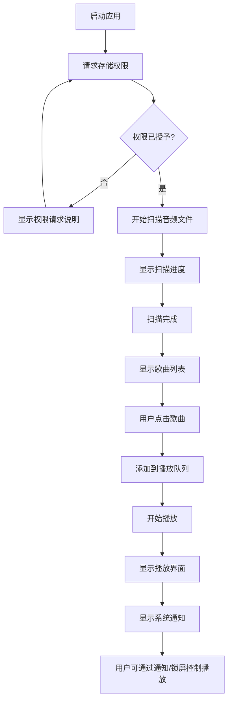

## 1. 引言与目的 (Introduction & Purpose)

本地音乐播放器是 AIDemo 应用的核心功能特性。此特性允许用户扫描设备存储中的音频文件，以列表形式展示，并提供基于 Media3 的播放功能，同时集成系统媒体通知和控制。

此特性解决的核心问题：
- 用户需要快速找到并播放本地存储的音频文件
- 用户希望播放控制能够集成到系统通知栏和锁屏界面
- 用户需要一个简洁、专注的本地音乐播放体验

此特性如何贡献于整体产品愿景：
- 实现应用的核心价值主张：简洁、专注的本地音乐播放
- 建立用户对应用的第一印象和核心使用场景
- 为后续功能扩展（如播放列表管理、音频可视化）奠定基础

## 2. 目标与宗旨 (Goals & Objectives)

### 具体目标
1. 实现高效的音频文件扫描功能，支持常见音频格式
2. 提供清晰的歌曲列表展示界面
3. 集成 Media3 1.9.0 播放引擎，实现稳定播放
4. 实现系统媒体通知和锁屏控制集成

### 可衡量成果
- 扫描 1000 首歌曲的时间 < 30 秒
- 播放启动延迟 < 500ms
- 系统通知和控制响应时间 < 200ms
- 支持至少 5 种常见音频格式（MP3、AAC、FLAC、WAV、OGG）

### 成功标准
- 用户能够成功扫描并看到所有本地音频文件
- 用户点击歌曲后能够立即开始播放
- 播放控制能够在系统通知栏和锁屏界面正常工作
- 应用在播放过程中保持稳定，无明显卡顿或崩溃

### 关键绩效指标 (KPI)
- 扫描成功率 > 99%
- 播放成功率 > 99.5%
- 用户首次使用完成播放流程的比例 > 90%

## 3. 范围 (Scope)

### 3.1. 范围内 (In Scope)

#### 3.1.1. 音频文件扫描
- 扫描设备 SD 卡和内部存储中的音频文件
- 支持递归扫描子目录
- 识别常见音频格式（MP3、AAC、FLAC、WAV、OGG、M4A）
- 提取音频元数据（标题、艺术家、专辑、时长、封面等）
- 后台异步扫描，显示扫描进度
- 扫描结果缓存，避免重复扫描

#### 3.1.2. 歌曲列表展示
- 列表形式展示所有扫描到的歌曲
- 显示歌曲基本信息：标题、艺术家、时长
- 支持列表滚动和快速定位
- 显示歌曲封面（如果有）
- 列表项点击交互反馈

#### 3.1.3. 播放功能
- 基于 Media3 1.9.0 播放引擎
- 点击歌曲后立即播放
- 自动将当前列表添加到播放队列
- 播放当前选中的歌曲
- 支持播放/暂停控制
- 支持上一首/下一首切换
- 显示播放进度和总时长
- 支持进度条拖拽跳转

#### 3.1.4. 系统媒体集成
- 在系统媒体中心显示播放信息和控制
- 通知栏显示播放通知，包含：
  - 歌曲标题和艺术家
  - 播放/暂停按钮
  - 上一首/下一首按钮
  - 关闭按钮
- 锁屏界面显示播放控制
- 支持蓝牙设备媒体控制
- 支持 Android Auto（如果设备支持）

#### 3.1.5. 播放服务
- 前台服务运行播放器，确保后台播放
- 服务生命周期管理
- 播放状态持久化（应用重启后恢复播放）

#### 3.1.6. 收藏功能
- 用户可以将喜欢的音频添加到收藏列表
- 支持在多个位置快速收藏/取消收藏：
  - 歌曲列表中的收藏按钮
  - 播放页面中的收藏按钮
  - 系统媒体通知栏中的收藏按钮
- 收藏状态实时同步到所有界面
- 使用 Room 数据库本地持久化收藏数据
- 收藏列表支持查看和管理

### 3.2. 范围外 (Out of Scope)

以下功能不在本特性范围内，可能在未来版本中实现：
- 播放列表创建和管理
- 歌曲搜索和筛选
- 音频均衡器和音效处理
- 歌词显示
- 音乐标签编辑
- 在线音乐流媒体
- 音乐推荐功能
- 多设备同步
- 音频可视化（波形、频谱）

## 4. 功能性需求与用户故事 (Functional Requirements & User Stories)

### 4.1. Story (用户故事): STORY-001 - 音频文件扫描
- **描述 (Description)**: 作为用户，我希望应用能够自动扫描设备存储中的音频文件，以便我能够看到所有可播放的音乐
- **状态 (Status)**: 草稿
- **目标版本 (Target Version)**: v1.0
- **详细故事文档 (Detailed Story Document)**: [./stories/STORY-001-audio-scan.md](./stories/STORY-001-audio-scan.md)

### 4.2. Story (用户故事): STORY-002 - 歌曲列表展示
- **描述 (Description)**: 作为用户，我希望以列表形式查看所有扫描到的歌曲，包括标题、艺术家和时长信息
- **状态 (Status)**: 草稿
- **目标版本 (Target Version)**: v1.0
- **详细故事文档 (Detailed Story Document)**: [./stories/STORY-002-song-list.md](./stories/STORY-002-song-list.md)

### 4.3. Story (用户故事): STORY-003 - 音乐播放与队列管理
- **描述 (Description)**: 作为用户，我希望点击歌曲后能够立即播放，并且当前列表自动添加到播放队列
- **状态 (Status)**: 草稿
- **目标版本 (Target Version)**: v1.0
- **详细故事文档 (Detailed Story Document)**: [./stories/STORY-003-playback-queue.md](./stories/STORY-003-playback-queue.md)

### 4.4. Story (用户故事): STORY-004 - Media3 播放引擎集成
- **描述 (Description)**: 作为用户，我希望应用使用 Media3 播放引擎提供稳定、流畅的播放体验
- **状态 (Status)**: 草稿
- **目标版本 (Target Version)**: v1.0
- **详细故事文档 (Detailed Story Document)**: [./stories/STORY-004-media3-integration.md](./stories/STORY-004-media3-integration.md)

### 4.5. Story (用户故事): STORY-005 - 系统媒体通知集成
- **描述 (Description)**: 作为用户，我希望在系统通知栏和锁屏界面看到播放控制，以便在不打开应用的情况下控制播放
- **状态 (Status)**: 草稿
- **目标版本 (Target Version)**: v1.0
- **详细故事文档 (Detailed Story Document)**: [./stories/STORY-005-media-notification.md](./stories/STORY-005-media-notification.md)

### 4.6. Story (用户故事): STORY-006 - 收藏功能
- **描述 (Description)**: 作为用户，我希望能够收藏喜欢的音频，并在列表、播放页和通知栏中快速收藏/取消收藏，以便快速访问我喜欢的音乐
- **状态 (Status)**: 草稿
- **目标版本 (Target Version)**: v1.0
- **详细故事文档 (Detailed Story Document)**: [./stories/STORY-006-favorite-management.md](./stories/STORY-006-favorite-management.md)

## 5. 非功能性需求 (此特性专属) (Non-Functional Requirements)

### 性能需求
- **扫描性能**: 扫描 1000 首歌曲的时间 < 30 秒（在中等性能设备上）
- **播放启动延迟**: 从点击歌曲到开始播放 < 500ms
- **UI 响应性**: 列表滚动保持 60fps，无卡顿
- **内存占用**: 应用运行时内存占用 < 150MB（不含音频缓冲）

### 可扩展性需求
- 扫描模块支持插件化扩展，便于未来支持更多音频格式
- 播放器模块设计为可替换，便于未来升级 Media3 版本
- 数据层支持缓存和持久化，使用 Room 数据库存储收藏数据
- 收藏功能设计为可扩展，便于未来添加多个收藏列表或标签功能

### 安全考量
- 正确处理存储权限请求（Android 13+ 使用分区存储）
- 音频文件访问遵循最小权限原则
- 播放服务使用前台服务，符合 Android 后台限制

### 可用性 / 用户体验 (UX) 指南
- 遵循 Material Design 3 设计规范
- 提供清晰的加载状态反馈（扫描进度、播放加载）
- 错误情况提供友好的错误提示
- 支持深色模式（Dark Mode）

### 无障碍性需求
- 支持 TalkBack 屏幕阅读器
- 按钮和交互元素符合最小触摸目标尺寸（48dp）
- 文本和图标有足够的对比度
- 支持系统字体缩放

## 6. 设计与用户体验 (UX) 考量 (Design & UX Considerations)

### UI/UX 原则
- **简洁性**: 界面简洁，避免不必要的元素
- **一致性**: 遵循 Material Design 3 设计语言
- **反馈性**: 所有用户操作都有明确的视觉反馈
- **可发现性**: 核心功能易于发现和使用

### 用户流程

### 关键界面
1. **歌曲列表界面**: 主要展示界面，显示所有扫描到的歌曲，包含收藏按钮
2. **播放控制界面**: 显示当前播放信息和控制按钮（可选，也可仅通过通知控制），包含收藏按钮
3. **扫描进度界面**: 首次启动或手动刷新时显示扫描进度
4. **收藏列表界面**: 显示所有收藏的歌曲（可选，v1.0 可仅支持收藏状态显示）

## 7. 技术考量与依赖关系 (Technical Considerations & Dependencies)

### 高层技术方法
- **架构模式**: MVVM（Model-View-ViewModel）
- **UI 框架**: 初期使用传统 View 系统，未来考虑迁移到 Jetpack Compose
- **异步处理**: Kotlin Coroutines + Flow
- **播放引擎**: Media3 1.9.0（ExoPlayer）
- **依赖注入**: 考虑使用 Hilt（可选）

### 关键集成点
- **Media3 Session**: 用于系统媒体通知和控制集成
- **Media3 ExoPlayer**: 核心播放引擎
- **Android MediaSession**: 系统媒体会话管理
- **Foreground Service**: 前台服务支持后台播放

### 技术依赖
- **Media3 库**:
  - `androidx.media3:media3-exoplayer:1.9.0`
  - `androidx.media3:media3-ui:1.9.0`
  - `androidx.media3:media3-session:1.9.0`
  - `androidx.media3:media3-common:1.9.0`
- **AndroidX 库**:
  - `androidx.lifecycle:lifecycle-viewmodel-ktx`
  - `androidx.lifecycle:lifecycle-runtime-ktx`
  - `androidx.core:core-ktx`
- **Room 数据库**:
  - `androidx.room:room-runtime`
  - `androidx.room:room-ktx`
  - `androidx.room:room-compiler` (kapt/ksp)

### 潜在技术风险或挑战
1. **存储权限**: Android 13+ 的分区存储权限处理
2. **性能优化**: 大量音频文件扫描的性能优化
3. **后台播放**: Android 后台限制下的播放服务稳定性
4. **Media3 集成**: MediaSession 和通知的复杂集成逻辑

### 设计文档链接
- 详细架构设计: [../../architecture/arch-overview.md](../../architecture/arch-overview.md)

## 8. 未来考量 / 此特性的潜在增强功能 (Future Considerations)

- **播放列表管理**: 允许用户创建、编辑和管理播放列表
- **搜索和筛选**: 支持按标题、艺术家、专辑等条件搜索和筛选
- **音频可视化**: 添加波形和频谱可视化效果
- **歌词显示**: 支持显示和同步歌词
- **音效处理**: 添加均衡器、重低音等音效选项
- **智能推荐**: 基于播放历史推荐相似歌曲
- **多设备同步**: 通过本地网络在多设备间同步播放状态

## 9. 待解决问题与假设 (Open Questions & Assumptions)

### 待解决问题
1. 是否需要支持网络音频文件播放？（假设：仅支持本地文件）
2. 扫描时是否允许用户选择特定目录？（假设：扫描所有可访问目录）
3. 是否需要支持播放模式（单曲循环、随机播放等）？（假设：v1.0 仅支持顺序播放）
4. 是否需要显示播放历史？（假设：v1.0 不需要）

### 假设
1. 用户设备有足够的存储空间存储音频文件
2. 用户授予必要的存储权限
3. 音频文件格式为标准格式，元数据完整
4. 设备支持 Media3 所需的最低 Android 版本（API 24+）
