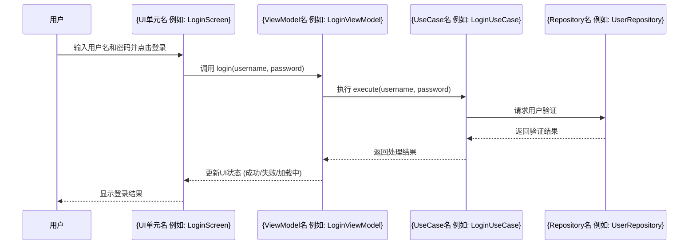

## 1. 引言 (Introduction)
- 简要说明本文档的目的：详细阐述实现 {Feature-Name} 特性的技术设计和考量。
- 引用主要的特性 PRD 文档：[链接到 ../index.md 或特定的 PRD 文件]

- 本文档详细说明了 **{Feature-Name} (特性名称)** 特性的技术设计，该特性在 [Feature PRD](../index.md) 中有概述。 <!-- 可考虑将 {Feature-Name} 也作为 YAML 变量 -->
- 本设计遵循 [应用架构概览](../../../architecture/arch-overview.md) 中定义的全局架构。

## 2. 详细设计与组件 (Detailed Design & Components)
- 将此特性分解为更小的、特定于此特性的技术组件、模块或 Android UI 单元 (如 Activity, Fragment, Composable 函数)。
- 描述这些组件的职责和交互。
- 根据需要包含此特性特定逻辑的详细图表 (Mermaid)。

### 2.1. 主要 UI 单元: {例如：UserLoginActivity, ProfileScreenComposable}
- **职责 (Responsibility)**:
- **关键用户交互 (Key User Interactions)**:
- **状态管理 (State Management)**: (例如：使用的 ViewModel, StateFlow/LiveData)
- **与 ViewModel/Presenter 的交互**:

### 2.2.核心业务逻辑组件: {例如：AuthUseCase, OrderValidationService}
- **职责 (Responsibility)**:
- **关键算法/逻辑 (Key Algorithms/Logic)**:
- **依赖注入 (Dependencies Injected)**:
- **与其他组件的交互 (Interactions with other components)**:

### 2.3. 数据处理组件: {例如：UserLocalDataSource, OrderRemoteApiHandler}
- **职责 (Responsibility)**:
- **数据来源/目的地 (Data Source/Destination)**:
- **数据转换逻辑 (Data Transformation Logic)**:

### 2.4. 关键交互序列图/流程图 (Sequence Diagram / Flowchart for key interactions within this feature)


## 3. API 规格 (如果此特性暴露或消费新的/修改的 API) (API Specifications)
- 定义请求/响应格式 (JSON 示例很好)。
- 指明端点、方法、认证方式、错误码。
- 如果使用 Swagger/OpenAPI 等工具，请链接至此。

### 3.1. 端点 (Endpoint): `POST /api/v1/{feature-resource}`
- **描述 (Description)**:
- **请求体 (Request Body)**:
  ```json
  {
    "param1": "value1",
    "param2": 123
  }
  ```
- **成功响应 (200/201) (Success Response)**:
  ```json
  {
    "id": "resource_id",
    "status": "created"
  }
  ```
- **错误响应 (Error Responses)**: (400, 401, 403, 500 等)

## 4. 数据模型与模式 (此特性专属) (Data Models & Schemas (specific to this feature))
<!--
- 定义此特性所需的新增或重大修改的数据结构、数据库表模式 (例如 Room Entity)、或对象模型 (例如 Kotlin data class)。
- 说明它们与现有全局数据模型的关系（如果适用）。
-->
### 4.1. {数据模型名称 例如: UserProfileEntity} 模式 (Schema)
```kotlin
// Room Entity 示例
@Entity(tableName = "user_profiles")
data class UserProfileEntity(
    @PrimaryKey val userId: String,
    val displayName: String?,
    val avatarUrl: String?
    // ... 其他字段
)
```
<!-- API 数据传输对象 (DTO) 示例 -->
```json
{
  "user_id": "string (用户ID)",
  "display_name": "string (昵称)",
  "email": "string (邮箱)"
}
```

## 5. 技术选型与论证 (此特性专属) (Technology Choices & Justifications (specific to this feature))
- 是否有专为此特性做出的、不同于或补充全局技术栈的技术选型？
- （例如：为特性中的某个特定任务选择的特定库，如图片裁剪、图表绘制）。
- 对这些选择进行论证。

## 6. 非功能性需求实现 (针对此特性) (Non-Functional Requirements Implementation (for this feature))
- 此特性的实现将如何满足其特定的 NFRs (性能、安全性、电池效率、离线支持等)？
- 例如：针对性能的缓存策略、针对安全性的输入验证、针对离线的数据同步逻辑。

- **性能 (Performance)**:
- **安全性 (Security)**:
- **离线能力 (Offline Capability)**:
- **电池效率 (Battery Efficiency)**:

## 7. 测试策略 (针对此特性) (Testing Strategy (for this feature))
- 概述此特性的关键单元测试、集成测试和 UI 测试 (Espresso/Compose Test) 场景。
- 此内容可以链接到或为 Story 文件中的详细测试用例提供信息。

- **单元测试 (Unit Tests)**: (例如：ViewModel 逻辑、UseCase 逻辑、Repository 数据转换)
- **集成测试 (Integration Tests)**: (例如：ViewModel 与 Repository 交互、数据库操作)
- **UI 测试 (UI Tests)**: (例如：用户交互流程、UI 状态验证)

## 8. 依赖关系与集成点 (Dependencies & Integration Points)

- 列出此特性依赖的其他特性、模块、Android 系统服务或外部服务。
- 描述集成契约/API (例如：通过 Intent 传递的数据、共享的 ContentProvider、依赖注入的接口)。
- **Android 权限**: 列出此特性需要的 Android 权限及其申请时机和理由。

- **内部依赖**:
- **外部服务依赖**:
- **所需 Android 权限**:
    - `android.permission.INTERNET`: (理由)
    - `android.permission.ACCESS_FINE_LOCATION`: (理由，以及如何处理用户拒绝)

## 9. 风险与缓解策略 (Risks & Mitigation Strategies)
- 识别实现此特性相关的潜在技术风险。
- 概述提议的缓解策略。

## 10. 待解决问题与决策日志 (Open Questions & Decisions Log)
- 跟踪任何需要解答的待解决技术问题。
- 记录在此特性设计过程中做出的关键技术决策。

| 问题/决策                                      | 状态/解决方案                                       | 日期       |
| ---------------------------------------------- | --------------------------------------------------- | ---------- |
| 如何处理X场景下的并发数据更新？                  | 决定：使用 Room 的事务和恰当的并发控制。                | YYYY-MM-DD |
| 选择哪个图片加载库处理用户头像？                 | 待定 (调研 Coil 和 Glide 的特定场景性能)               | YYYY-MM-DD |

## 11. 变更日志 (此设计文档) (Change Log (for this design document))
| 版本    | 日期       | 变更描述                                       | 作者/参考     |
| ------- | ---------- | ---------------------------------------------- | ------------- |
| 1.0.0   | YYYY-MM-DD | {Feature-Name} 特性设计初稿。                    | {用户/StoryID} |
|         |            |                                                |               |