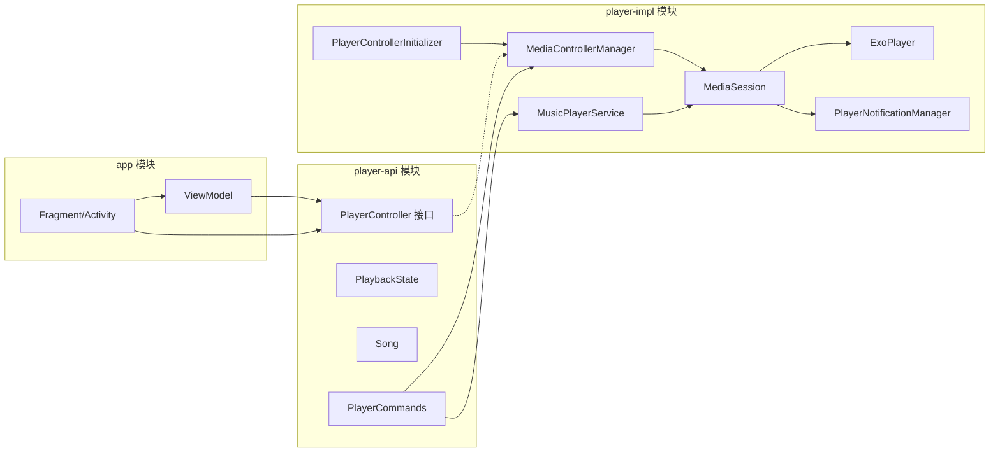
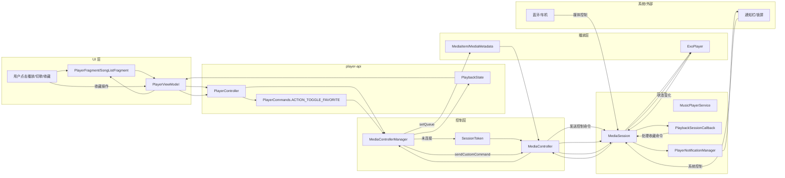

# 项目架构与播放器实现分析

## 概览
本项目为 Android 本地音乐播放器，采用单 Activity + 多 Fragment + Navigation 架构。核心播放能力已抽取为强隔离模块：`player-api`（接口与模型）与 `player-impl`（Media3 具体实现），App 仅依赖 API 层以降低耦合并便于替换播放实现。

## 模块划分
- `app`：UI、导航、权限、ViewModel 等应用层逻辑。
- `player-api`：播放控制接口与模型（`PlayerController`、`PlaybackState`、`Song`、`PlayerCommands`）。
- `player-impl`：Media3 实现、`MediaSessionService`、通知、控制器工厂与自动初始化。

## 关键目录
- `app/src/main/java/com/valiantyan/music801/ui/`：界面与交互。
- `app/src/main/java/com/valiantyan/music801/viewmodel/`：UI 状态与业务控制。
- `player-api/src/main/java/com/valiantyan/music801/`：对外契约（接口/模型）。
- `player-impl/src/main/java/com/valiantyan/music801/`：Media3 播放实现与后台服务。

## 播放器执行链路
1. **UI 触发**：`PlayerFragment`/`SongListFragment` 通过 `PlayerViewModel` 调用 `PlayerController`。
2. **控制器连接**：`MediaControllerManager` 使用 `MediaController` 连接 `MusicPlayerService` 的 `MediaSession`。
3. **服务创建**：`MusicPlayerService` 在 Service 内创建 `ExoPlayer` 与 `MediaSession`，并挂接通知管理。
4. **命令执行**：播放、切歌、seek 等命令走 `MediaController` -> `MediaSession` -> `ExoPlayer`。
5. **状态同步**：`MediaControllerManager` 监听 `Player.Listener` 并定时刷新，更新 `PlaybackState`。
6. **自定义命令**：收藏按钮通过 `PlayerCommands.ACTION_TOGGLE_FAVORITE` 发送到 `MediaSession.Callback`。

## 强隔离策略
- **API 层仅暴露接口**：`player-api` 不依赖 Media3。
- **实现层 internal**：`player-impl` 内部类尽量 `internal`，避免被 app 直接引用。
- **Startup 注册**：`PlayerControllerInitializer` 使用 AndroidX Startup 自动注册控制器工厂。

## 架构 Mermaid

## 播放器组件职责
- **`PlayerController`**：对外播放控制 API（播放、暂停、切歌、seek、收藏）。
- **`MediaControllerManager`**：封装 `MediaController` 连接、队列与状态同步。
- **`MusicPlayerService`**：持有 `ExoPlayer` 与 `MediaSession`，处理系统命令与自定义命令。
- **`PlayerNotificationManager`**：媒体通知与前台服务控制。

## 关键差异与修正
- 已严格对齐官方 Media3 架构：`ExoPlayer` 与 `MediaSession` 在 `MediaSessionService` 中创建并管理。
- UI 完全通过 `MediaController` 驱动，避免直接触碰底层播放器。
- 收藏按钮作为 `SessionCommand` 自定义命令实现，并可通过 `PlayerCommands` 对外稳定暴露。

## 推荐后续扩展
- 收藏状态持久化：Room/DataStore。
- `PlaybackState` 扩展收藏字段并通知 UI。
- 自定义命令添加结果反馈与 UI 展示（Toast/图标切换）。

## 播放器执行流程图（详细版）

