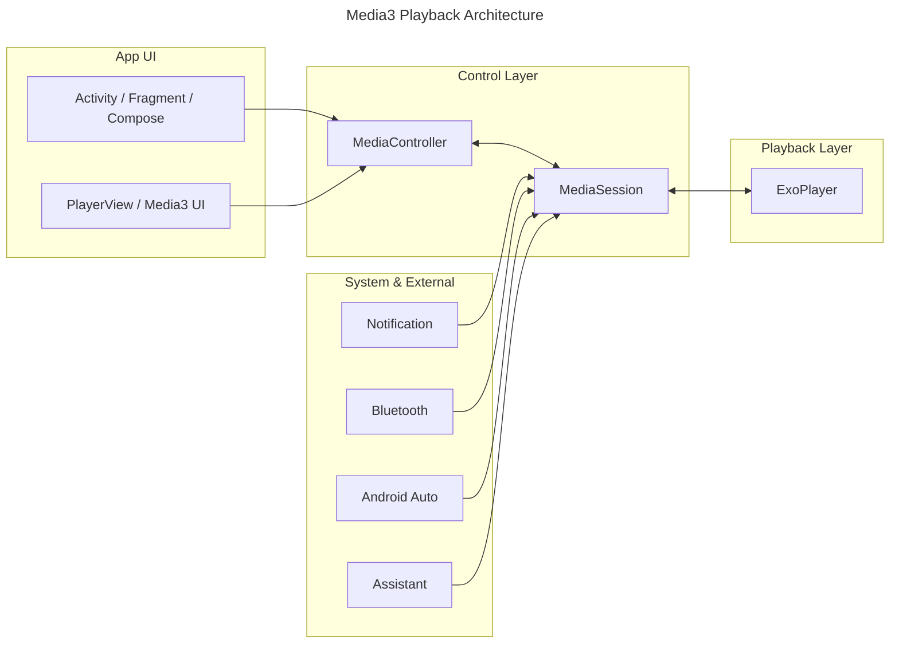

# Media3 框架内容与架构设计总结

## 概述

Media3 是 Android 官方现代媒体栈，提供播放、会话控制、UI 组件、媒体处理等能力。核心目标是统一 API、简化系统集成，并替代旧版 ExoPlayer/MediaCompat 体系。

## 核心组件

- `ExoPlayer`：媒体播放核心，实现解码、渲染、缓存与状态管理。
- `MediaItem`：媒体资源统一描述入口，支持 URI、字幕、DRM、元数据。
- `MediaSession`：向系统与外部控制器暴露统一控制入口，持有 `Player`。
- `MediaSessionService`：在独立 Service 中承载会话与播放器，支持后台播放。
- `MediaController`：客户端控制器，实现 `Player` 接口，向会话发送指令。
- `MediaLibraryService`：提供媒体库浏览能力，配合 `MediaBrowser` 服务于车机/语音助手。
- `media3-ui`/`media3-ui-compose`：内建 UI 组件与 Compose 组件。
- `Transformer`：媒体转码与处理能力（按需引入）。

## 架构设计

### 组件层级

- UI 层：Activity/Fragment/Compose 绑定 `MediaController` 或 `PlayerView`。
- 控制层：`MediaController` 与 `MediaSession` 之间进行指令与状态同步。
- 播放层：`ExoPlayer` 实际执行播放任务。
- 系统层：通知栏、蓝牙、车机、语音助手通过 `MediaSession` 访问。



## 播放流程

1. UI 创建 `SessionToken` 并异步建立 `MediaController`。
2. `MediaController` 作为 `Player` 接口绑定到 UI。
3. `MediaSessionService` 中创建 `ExoPlayer` 与 `MediaSession`。
4. `MediaSession` 将外部控制与播放器状态统一同步。
5. 系统控制入口（通知栏/蓝牙/车机）通过会话控制播放。

## 会话与外部控制

- `MediaSession` 是系统控制与外部应用控制的统一入口。
- `MediaController` 与 `MediaBrowser` 都实现 `Player` 接口，使用方式一致。
- `MediaSessionService.onGetSession()` 必须返回当前 `MediaSession` 以供外部访问。
- 可用 `SessionCommand` 与 `CommandButton` 实现自定义操作（例如收藏、下载）。

## 后台播放

- 必须通过 `MediaSessionService` 持有会话与播放器。
- `AndroidManifest.xml` 配置 `foregroundServiceType="mediaPlayback"` 并申请前台服务权限。
- 服务生命周期内创建与释放播放器和会话，保证资源管理与稳定性。

## UI 与状态同步

- 播放/暂停按钮使用 `Util.shouldShowPlayButton()` 和 `Util.handlePlayPauseButtonAction()`。
- 通过 `Player.Listener.onEvents()` 监听关键事件，以批量更新 UI。
- Compose 通过 `rememberPlayPauseButtonState(player)` 快速接入状态。

## 迁移设计要点

- 包名迁移到 `androidx.media3`。
- 依赖替换为 `media3-exoplayer`、`media3-ui`、`media3-common`、`media3-session`。
- `MediaSession` 直接接 `Player`，不再依赖旧 Connector。
- 可使用 `media3-migration.sh` 自动化迁移。

## 音乐播放场景落地建议

- 使用 `MediaSessionService` 承载播放，保证后台稳定性。
- 使用 `MediaController` 连接 UI 与会话，复用 `Player` 接口。
- 统一播放队列管理，并在 `MediaItem` 中维护元数据。
- 提供自定义会话按钮扩展收藏/喜欢等业务操作。
- 若需车机/语音助手支持，扩展 `MediaLibraryService`。

## 关键依赖示例

```gradle
implementation "androidx.media3:media3-exoplayer:1.9.0"
implementation "androidx.media3:media3-ui:1.9.0"
implementation "androidx.media3:media3-common:1.9.0"
implementation "androidx.media3:media3-session:1.9.0"
```
